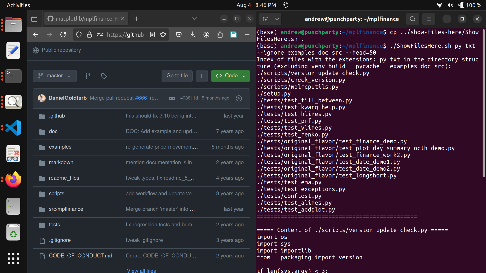
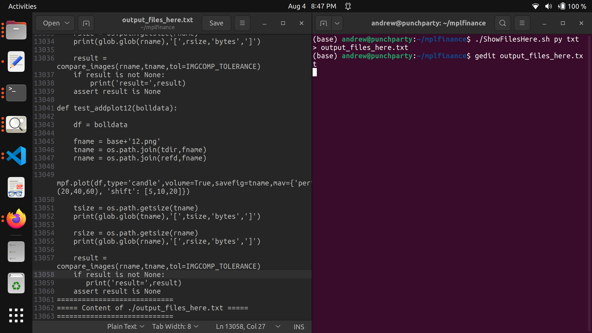
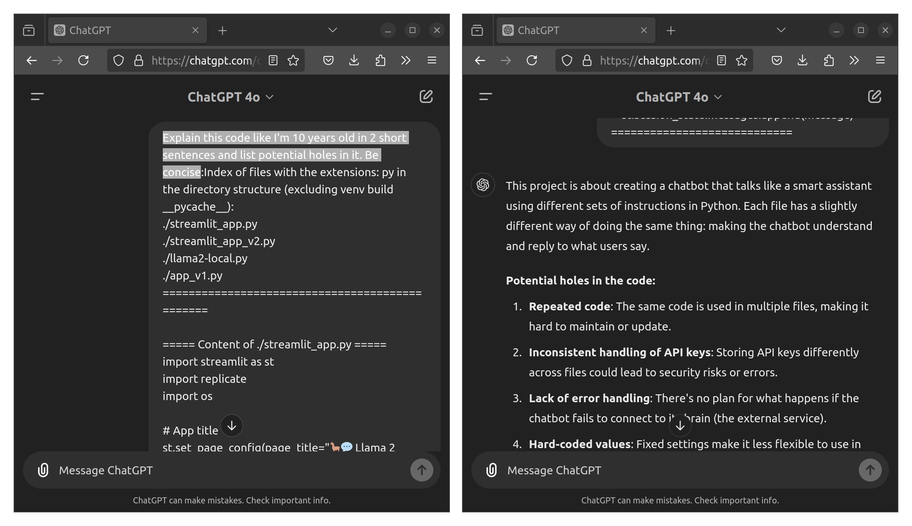

# files-here-wzrd

A powerful toolset to capture and recreate directory structures with ease! Generate a comprehensive overview of your project files and rebuild them as needed.

## Overview

The `files-here-wzrd` toolkit includes two key scripts:

- **`ShowFilesHere.sh`**: Captures and outputs all files with specified extensions in a directory into a single, organized `.txt` file.
- **`MakeFilesHere.sh`**: Reconstructs files and their directory structure from a `.txt` file created by `ShowFilesHere.sh`.

This toolkit is ideal for developers, researchers, and teams working with large codebases or datasets who need a quick way to navigate and document their projects or to reconstruct files for easier distribution or analysis with AI tools.

## Features

### `ShowFilesHere.sh`

`ShowFilesHere` is a versatile script designed to list and display the content of files with specified extensions within the current directory and its subdirectories. By default, it ignores certain directories to keep your search focused and efficient.

This tool is useful for developers, researchers, and students to quickly understand and navigate large codebases or datasets. The output can be used for analysis through advanced AI tools like ChatGPT, Gemini, etc.





## Features

- **Customizable File Search**: Specify one or more file extensions to list and display.
- **Directory Ignoring**: By default, ignores `venv/`, `build/`, and `__pycache__/` directories to avoid clutter. Additional directories can be ignored using the `--ignore` flag.
- **Head and Tail Options**: Optionally print the first `N` lines or last `N` lines of the full output using the `--head=N` and `--tail=N` flags.
- **Cross-Platform Compatibility**: Can be used on Linux, macOS, and Windows (using Python or Converting .py to Executable).
- **Easy Integration**: Use the script to generate comprehensive overviews of project files, which can be used for documentation, code reviews, or integration with AI tools like ChatGPT or Gemini.


### `MakeFilesHere.sh`

- **Easy Reconstruction**: Reads the output `.txt` file from `ShowFilesHere.sh` and recreates the original files and directories.
- **Cross-Platform**: Easily run on any system with Bash support.

## Example Usage

### Using `ShowFilesHere.sh` (Linux and macOS)

1. **Make script executable**:
    ```sh
    chmod +x ShowFilesHere.sh
    ```

2. **Run the script**:
    ```sh
    # Output HEAD in terminal
    ./ShowFilesHere.sh py txt --ignore logs temp --head=20 
    # OR Print all output to a text file
    ./ShowFilesHere.sh py txt --ignore logs temp > output_files_here.txt
    ```

#### Windows Users 
You can use the `ShowFilesHere.py` Python script directly or compile it into an executable (`.exe`) using `PyInstaller`.

##### Option 1: Run the Python Script

1. **Open Command Prompt** and navigate to the directory containing `ShowFilesHere.py`.

2. **Run the Python script**:
    ```cmd
    python ShowFilesHere.py py txt --ignore logs temp --head=20
    ```

##### Option 2: Compile to `.exe` with PyInstaller

1. **Install PyInstaller**:
    Open Command Prompt and run:
    ```cmd
    pip install pyinstaller
    ```

2. **Compile the Python script**:
    ```cmd
    pyinstaller --onefile ShowFilesHere.py
    ```

3. **Run the Executable**:
   Navigate to the `dist` directory where the executable is created and run:
    ```cmd
    ShowFilesHere.exe py txt --ignore logs temp --head=20
    ```


### Using `MakeFilesHere.sh`

1. **Make script executable**:
    ```bash
    chmod +x MakeFilesHere.sh
    ```

2. **Run the script**:
    ```bash
    ./MakeFilesHere.sh project_overview.txt
    ```

3. **Reconstructed Project**: This will recreate the original project structure and files as defined in `project_overview.txt`.

### Using with AI Tools like GPT

You can leverage AI tools to generate code projects and reconstruct them using `MakeFilesHere.sh`. For example, when interacting with GPT, you can provide a prompt to generate a complete project in the required format.

#### Prompt Sample (`MFH_prompt.txt`)

We used the following prompt to generate the [Honeycomb Web App](link_to_app):

```
Generate the complete code for a Next.js app that simulates honeybees in a honeycomb. Output the entire project in a .txt file where each file starts with <<< FILE START: <file_path> >>> and ends with <<< FILE END: <file_path> >>>.
```

By providing this prompt to GPT, you can obtain a `.txt` file with the entire project structured as specified. Use `MakeFilesHere.sh` to effortlessly reconstruct the project files from this output.

#### Steps:

1. **Generate Project with GPT**:
   - Provide the prompt from `MFH_prompt.txt` to GPT.
   - Save the output to a file, e.g., `honeybee_project.txt`.

2. **Reconstruct the Project**:
   ```bash
   ./MakeFilesHere.sh honeybee_project.txt
   ```

3. **Result**:
   - The script will recreate the Next.js app with all the files and directories as defined in the GPT output.

## Benefits

- **Simplify Documentation**: Instantly capture a structured view of your project files.
- **Effortless Reconstruction**: Share your project in a single `.txt` file and use `MakeFilesHere.sh` to restore it.
- **AI-Driven Development**: Generate entire projects using AI tools and reconstruct them with ease.

## License

This toolkit is open-source and available under the [MIT License](LICENSE).
