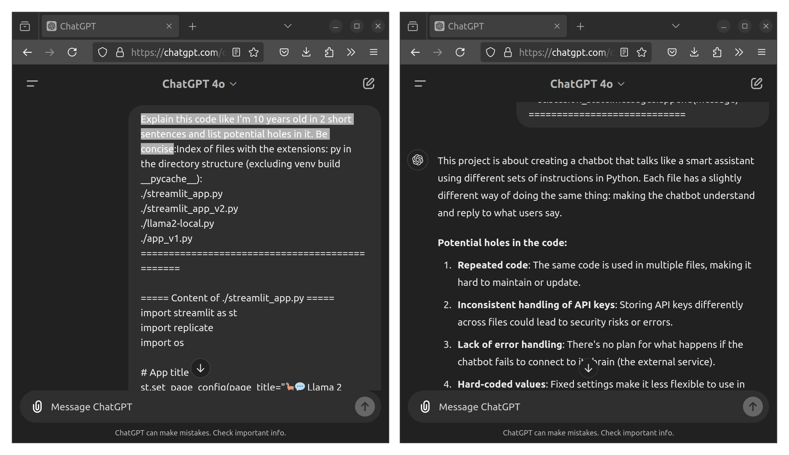

# `ShowFilesHere.sh`

`ShowFilesHere` is a versatile script designed to list and display the content of files with specified extensions within the current directory and its subdirectories. By default, it ignores certain directories to keep your search focused and efficient.

This tool is useful for developers, researchers, and students to quickly understand and navigate large codebases or datasets. The output can be used for analysis through advanced AI tools like ChatGPT, Gemini, etc.




## Features

- **Customizable File Search**: Specify one or more file extensions to list and display.
- **Directory Ignoring**: By default, ignores `venv/`, `build/`, and `__pycache__/` directories to avoid clutter. Additional directories can be ignored using the `--ignore` flag.
- **Head and Tail Options**: Optionally print the first `N` lines or last `N` lines of the full output using the `--head=N` and `--tail=N` flags.
- **Cross-Platform Compatibility**: Can be used on Linux, macOS, and Windows (using Python or Converting .py to Executable).
- **Easy Integration**: Use the script to generate comprehensive overviews of project files, which can be used for documentation, code reviews, or integration with AI tools like ChatGPT or Gemini.


## Using `ShowFilesHere.sh` (Linux and macOS)

1. **Make script executable**:
    ```sh
    chmod +x ShowFilesHere.sh
    ```

2. **Run the script**:
    ```sh
    # Output HEAD in terminal
    ./ShowFilesHere.sh py txt --ignore logs temp --head=20 
    # OR Print all output to a text file
    ./ShowFilesHere.sh py txt --ignore logs temp > output_files_here.txt
    ```

### Windows Users 
You can use the `ShowFilesHere.py` Python script directly or compile it into an executable (`.exe`) using `PyInstaller`.

#### Option 1: Run the Python Script

1. **Open Command Prompt** and navigate to the directory containing `ShowFilesHere.py`.

2. **Run the Python script**:
    ```cmd
    python ShowFilesHere.py py txt --ignore logs temp --head=20
    ```

#### Option 2: Compile to `.exe` with PyInstaller

1. **Install PyInstaller**:
    Open Command Prompt and run:
    ```cmd
    pip install pyinstaller
    ```

2. **Compile the Python script**:
    ```cmd
    pyinstaller --onefile ShowFilesHere.py
    ```

3. **Run the Executable**:
   Navigate to the `dist` directory where the executable is created and run:
    ```cmd
    ShowFilesHere.exe py txt --ignore logs temp --head=20
    ```
